# kubeharbor System Design Document

**Reference Architecture Environment**  
**Version:** 1.0  
**Date:** June 17, 2026

---

## Table of Contents

1. [Executive Summary](#executive-summary)
2. [System Architecture Overview](#system-architecture-overview)
3. [Architecture Principles](#architecture-principles)
4. [Infrastructure Baseline](#infrastructure-baseline)
5. [Repository and Bundle Layout](#repository-and-bundle-layout)
6. [Component Deep Dive](#component-deep-dive)
7. [Deployment Architecture](#deployment-architecture)
8. [Air-Gap Artifact Supply Chain](#air-gap-artifact-supply-chain)
9. [Runtime Architecture](#runtime-architecture)
10. [Storage Architecture](#storage-architecture)
11. [Security Architecture](#security-architecture)
12. [Image Promotion Architecture](#image-promotion-architecture)
13. [Operations Architecture](#operations-architecture)
14. [Failure Modes and Recovery](#failure-modes-and-recovery)
15. [Hardening and Improvement Roadmap](#hardening-and-improvement-roadmap)
16. [Appendices](#appendices)

---

## Executive Summary

`kubeharbor` is a Docker-based, single-node Harbor deployment bundle for an Ubuntu 24.04 LTS virtual machine operating as an internal container registry for air-gapped Kubernetes and platform engineering workflows. The design goal is straightforward: build a deterministic Harbor host that can be staged on an Internet-connected system, transported into an isolated environment, and used as the upstream registry for RKE2, Rancher, Argo CD, Istio, monitoring, and related platform image promotion.

This is not a high-availability Harbor architecture. That is not a footnote; it is a design constraint. The VM is a critical platform dependency, and if it is offline, downstream cluster lifecycle operations will feel it immediately. The architecture compensates with predictable installation, explicit artifact validation, `/data`-backed Docker/containerd storage, systemd-managed lifecycle hooks, clean operational runbooks, and a large-image pull/push workflow designed for air-gapped promotion.

### Key Characteristics

- **Single-node Harbor registry** deployed on Ubuntu 24.04 LTS.
- **Docker Engine and Docker Compose plugin runtime** installed from local `.deb` packages for air-gap compatibility.
- **Harbor v2.15.1 offline installer** staged from an Internet-connected host.
- **TLS-first registry access** using the `kubeharbor.dev.kube` hostname and locally staged certificate material.
- **500 GB `/data` storage model** for Harbor data, Docker image cache, containerd content, and bulk image transfer workflows.
- **Optional Docker Hardened Image portal override** that swaps only the Harbor `portal` service after the official Harbor installer renders Compose assets.
- **Checksum-enforced artifact intake** for Docker packages, Harbor installer, and saved extra image archives.
- **Image transfer workflow** that supports Internet-connected pull, VM clone/move, and air-gapped push into Harbor.

### Business and Mission Value

The registry is a control point for software supply-chain continuity in disconnected environments. It reduces repeated Internet dependency, establishes a consistent internal image namespace, and gives platform operators a repeatable staging path for large Kubernetes application stacks. In enterprise terms, kubeharbor is a foundational enablement layer: it does not run the mission workload, but the mission workload deployment pipeline depends on it.

---

## System Architecture Overview

The kubeharbor design separates the system into four practical domains:

1. **Internet-connected staging domain** that downloads Docker packages, the Harbor offline installer, and any required extra image archives.
2. **Transfer package domain** that bundles verified artifacts into a moveable tarball while excluding secrets and runtime byproducts.
3. **Air-gapped Harbor runtime domain** where Docker, Harbor, certificates, storage, and lifecycle services are installed.
4. **Consumer/client domain** made up of Kubernetes nodes, admin workstations, and image promotion utilities that push to or pull from the registry.

The diagram format intentionally follows the same Mermaid convention used by the `k8s-mystical-mesh-documents` system design document: inline `flowchart TB`, named `cluster_*` subgraphs, HTML line breaks in labels, and explicit `style` declarations for architectural emphasis.

### Architecture Diagram

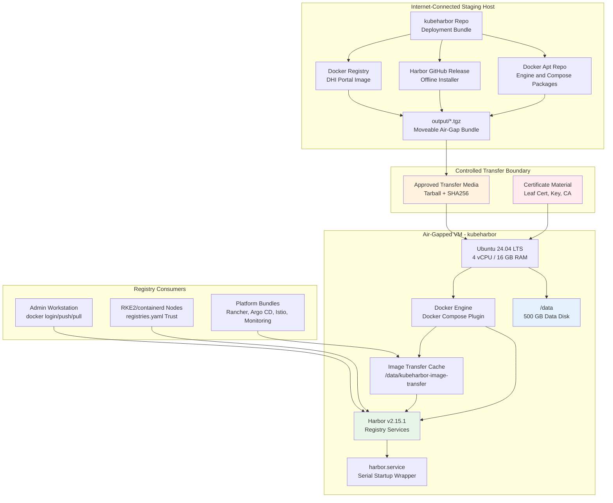

---

## Architecture Principles

### Deterministic First, Convenient Second

The bundle prioritizes repeatability over cleverness. Installation order is explicit, version checks are enforced, checksums are validated, and Harbor service startup is serialized to avoid known logger bootstrap races. This matters in an air-gapped environment because failed installs are expensive to unwind when packages and images cannot be fetched on demand.

### Keep Heavy State off the OS Disk

The VM has a 64 GB OS disk and a 500 GB data disk. Docker image pulls, containerd content, Harbor registry blobs, and image transfer logs must live under `/data`. Allowing large image workflows to land under `/var/lib/docker` is a self-inflicted outage. The design explicitly sets Docker and containerd storage paths under `/data`.

### Fail Fast Before Mutating the Runtime

Preflight checks block the common deployment killers before the installer gets deep into Harbor state changes: missing settings, weak or placeholder passwords, missing certificates, TLS SAN mismatch, Harbor version mismatch, checksum mismatch, missing data mount, and invalid DHI portal combinations.

### Prefer Explicit Air-Gap Boundaries

The repository separates Internet-side artifact acquisition from air-gapped installation. The staging script builds the moveable package. The air-gapped VM consumes it. The image transfer workflow can either use a clone-and-promote model or push directly from a prepared cache. No step should silently assume Internet access once the target VM is isolated.

### Treat Secrets as Inputs, Not Repo Assets

Production TLS keys, Docker credentials, and registry credentials are intentionally excluded from the package. The document and scripts assume secrets are injected by the operator at deploy time, not carried in source control.

---

## Infrastructure Baseline

| Layer | Baseline |
| --- | --- |
| VM name | `kubeharbor` |
| FQDN | `kubeharbor.dev.kube` |
| OS | Ubuntu 24.04 LTS amd64 |
| CPU | 4 vCPU minimum target |
| Memory | 16 GB target |
| OS disk | 64 GB |
| Data disk | 500 GB mounted at `/data` |
| Container runtime | Docker Engine + Docker Compose plugin |
| Harbor version | `v2.15.1` |
| Harbor install path | `/opt/harbor` |
| Harbor data path | `/data` |
| Docker data root | `/data/docker` |
| containerd root | `/data/containerd` |
| Image transfer root | `/data/kubeharbor-image-transfer` |
| TLS hostname | `kubeharbor.dev.kube` |
| Lifecycle unit | `harbor.service` |

### Target VM Resource View

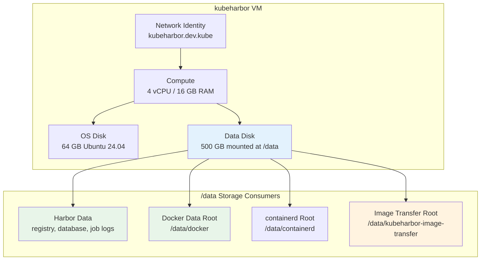

---

## Repository and Bundle Layout

The repository is structured as an air-gap deployment package rather than a traditional application source tree.

| Path | Purpose |
| --- | --- |
| `install.sh` | Top-level orchestrator for the air-gapped install flow. |
| `config/harbor.env` | Operator-editable deployment settings and feature toggles. |
| `config/harbor.yml.template` | Golden Harbor configuration template rendered into `/opt/harbor/harbor.yml`. |
| `certs/` | Local staging location for TLS leaf certificate, key, and CA certificate. |
| `installers/` | Harbor offline installer tarball and checksum file. |
| `packages/docker-debs/` | Offline Docker Engine, CLI, containerd, Buildx, Compose plugin, and dependencies. |
| `images/` | Saved Docker image archives, including the optional DHI Harbor portal image. |
| `scripts/` | Air-gapped install, validation, lifecycle, backup, reset, and client trust scripts. |
| `systemd/harbor.service` | Host lifecycle unit for Harbor Compose stack startup/shutdown. |
| `tools/` | Internet-side artifact downloader, cleanup utility, and large-image transfer wrappers. |
| `docs/` | Operator-facing documentation, runbooks, hardening notes, and this design document. |

### Repository Execution Model

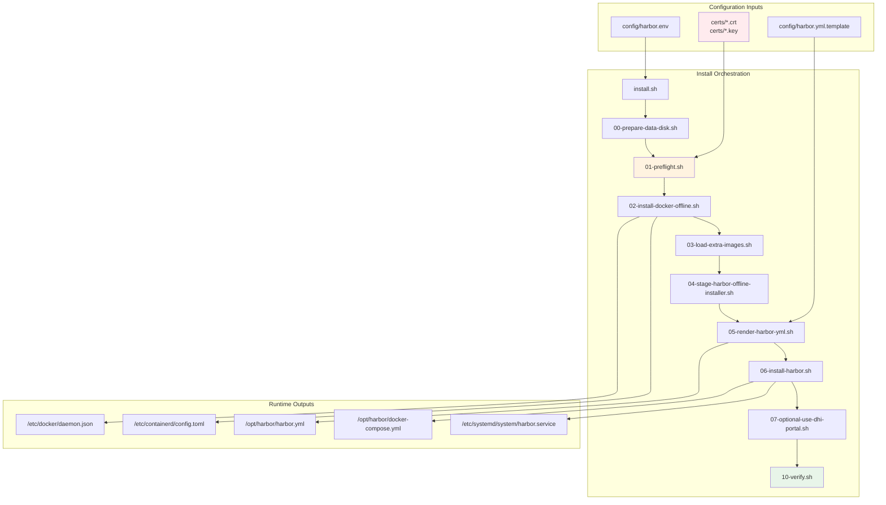

---

## Component Deep Dive

### `install.sh` Orchestrator

`install.sh` is the control-plane entry point for the air-gapped VM. It sources `config/harbor.env`, exports the settings required by child scripts, and runs the install pipeline in a fixed sequence. The current sequence is intentionally linear:

1. Prepare or validate the data disk.
2. Run preflight checks.
3. Install Docker from offline packages or validate existing Docker.
4. Load extra image archives.
5. Stage the Harbor offline installer.
6. Render `harbor.yml`.
7. Install and start Harbor.
8. Optionally apply the DHI portal override.
9. Verify the final runtime.

This is the right call for the target environment. Parallelism would make logs noisier and failure correlation worse. Air-gapped installers should be boring.

### `config/harbor.env`

`config/harbor.env` is the deployment contract. It defines the hostname, ports, Harbor version, data paths, TLS source and destination paths, Docker/containerd storage roots, DHI portal settings, firewall behavior, and image transfer root.

The passwords currently present in the repository are deployment placeholders for the lab workflow and must not be treated as production-ready. Before a production-like install, rotate `HARBOR_ADMIN_PASSWORD` and `HARBOR_DB_PASSWORD`, keep them out of Git history, and store them in an approved secret escrow process.

### `config/harbor.yml.template`

The Harbor template is rendered into `/opt/harbor/harbor.yml`. It contains the external hostname, HTTP/HTTPS ports, TLS file paths, admin and database settings, data volume, Trivy offline settings, jobservice tuning, log rotation behavior, proxy placeholders, upload purge policy, and Harbor configuration version.

### Offline Docker Runtime

The bundle installs Docker Engine and Docker Compose plugin from local `.deb` files. The runtime design configures:

- Docker `data-root` under `/data/docker`.
- `overlay2` storage driver.
- Docker `live-restore` enabled.
- Docker log rotation using `json-file` limits.
- Optional containerd root under `/data/containerd`.
- A compatibility `docker-compose` wrapper backed by Docker Compose v2.

The operational intent is simple: avoid OS disk exhaustion, keep the Compose workflow compatible with Harbor installer expectations, and keep Docker runtime state tied to the large data disk.

### Harbor Runtime Components

Harbor is deployed from the official offline installer, then managed through Docker Compose and systemd. The runtime services include:

| Service | Function |
| --- | --- |
| `proxy` | External HTTPS/HTTP entry point for Harbor UI, API, and registry traffic. |
| `core` | Harbor API, authentication integration, metadata, and project logic. |
| `portal` | Web UI static content service. Optionally replaced with DHI portal image. |
| `registry` | OCI/Docker distribution registry backend. |
| `registryctl` | Registry controller sidecar for Harbor registry operations. |
| `jobservice` | Asynchronous job execution for replication, garbage collection, scanning jobs, and task processing. |
| `postgresql` | Harbor metadata database. |
| `redis` | Cache and job coordination backend. |
| `log` | Local syslog/log collector used by the Harbor Compose stack. |
| `trivy` | Optional vulnerability scanner; disabled by default unless offline DB lifecycle is handled. |

### Optional DHI Portal Override

The DHI portal override is deliberately narrow. It does not replace the full Harbor stack. It only swaps the `portal` service image after the official installer generates `docker-compose.yml` and the default Harbor portal Nginx config.

The override script:

1. Confirms `USE_DHI_HARBOR_PORTAL=true`.
2. Confirms the DHI portal image exists in the local Docker cache.
3. Backs up `docker-compose.yml` and portal `nginx.conf`.
4. Patches the portal Nginx config for the DHI image runtime model.
5. Changes only the portal service image.
6. Removes forced user overrides so the image metadata can define runtime identity.
7. Validates the rendered Compose config.
8. Runs an Nginx config test inside the DHI portal image.
9. Recreates only the portal service.
10. Rolls back automatically if validation or health gating fails.

That design is conservative and correct. Replacing one component inside a vendor-provided Compose stack is a compatibility risk; the script reduces that risk with backups, config validation, and rollback gates.

---

## Deployment Architecture

### End-to-End Deployment Flow

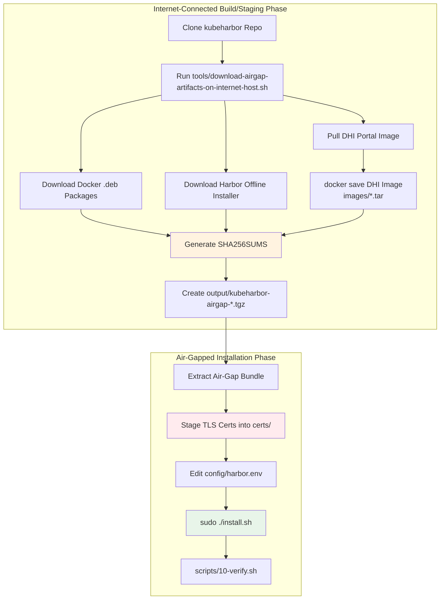

### Air-Gapped Install Sequence

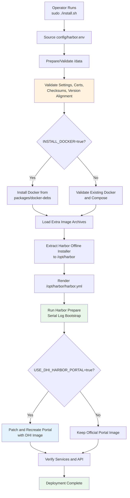

---

## Air-Gap Artifact Supply Chain

The artifact supply chain is intentionally split so the Internet-connected system does all external retrieval while the air-gapped VM only performs local validation and install.

### Artifact Categories

| Artifact | Source | Destination | Validation |
| --- | --- | --- | --- |
| Docker `.deb` packages | Docker apt repository and dependencies | `packages/docker-debs/` | Local `SHA256SUMS` file |
| Harbor offline installer | Harbor release asset | `installers/` | Filename/version check and `SHA256SUMS` |
| Harbor release sidecars | Harbor release adjacent assets when available | `installers/` | Best-effort collection; not required for install |
| DHI portal image | Docker registry | `images/*.tar` | `docker save`, inspect JSON, and `SHA256SUMS` |
| TLS leaf cert/key/CA | Operator-provided secure path | `certs/` on target | OpenSSL readability, key match, SAN/CN, optional CA chain |
| Large platform images | Image list bundle workflow | `/data/docker` cache and Harbor registry | Pull/push logs and representative pull tests |

### Artifact Integrity Flow

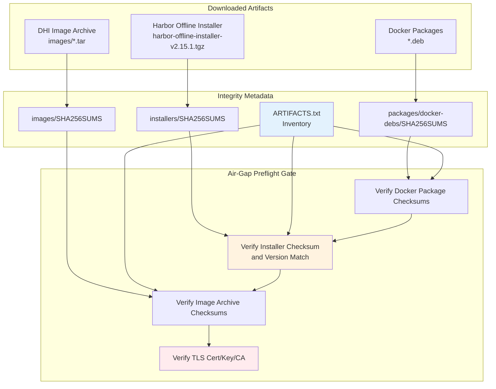

### Credential Handling

The Internet staging script prompts for Docker registry credentials only when needed to pull the DHI image. It uses an ephemeral Docker configuration directory under `/tmp`, logs out during cleanup, and removes the temporary config on exit. That is the correct control. Persisting registry credentials under `/root/.docker/config.json` on a staging host is unnecessary risk.

---

## Runtime Architecture

Harbor runs as a Docker Compose application under `/opt/harbor`. The systemd unit wraps the startup behavior so operators can use `systemctl start harbor`, while the actual lifecycle remains Compose-based.

### Runtime Component Diagram

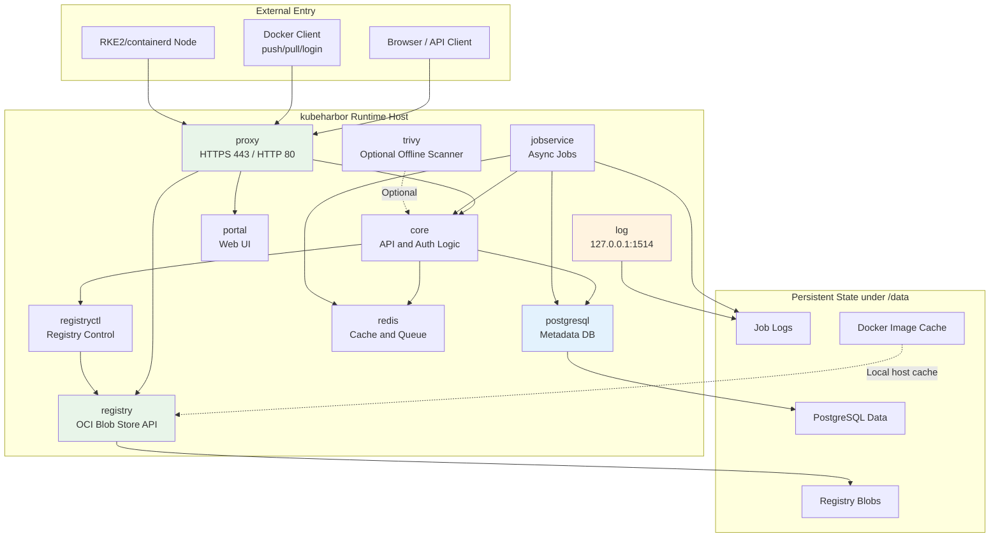

### Startup Model

The startup sequence intentionally starts `harbor-log` first, waits for the local listener on `127.0.0.1:1514`, and then starts the remaining Harbor services. This removes a class of startup races where dependent containers try to emit logs before the log service is available.

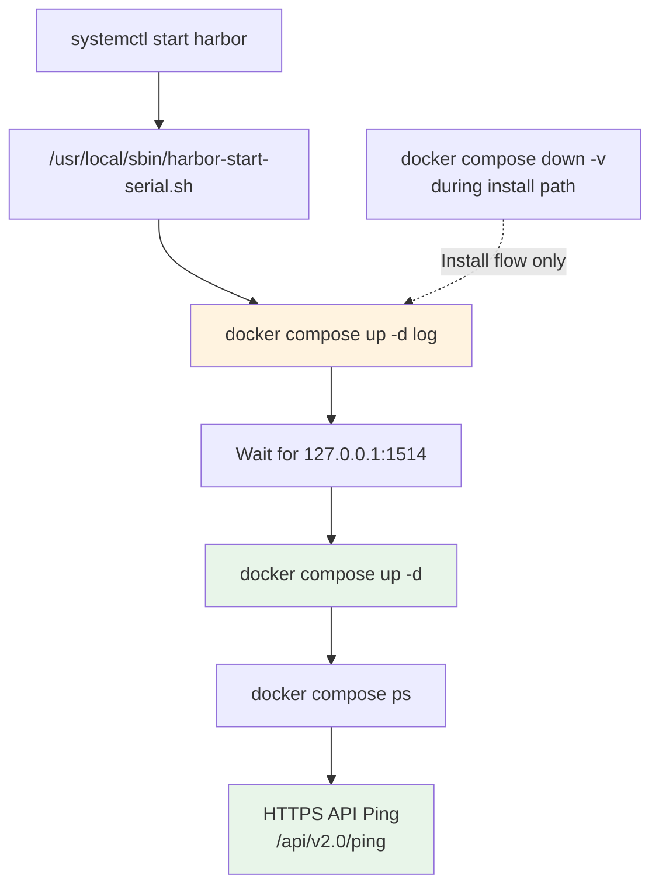

---

## Storage Architecture

The storage model is the make-or-break part of this design. Harbor and large image workflows are storage-heavy. The architecture assumes the OS disk is not sized for image acquisition, registry growth, or container runtime content.

### Storage Allocation

| Path | Backing | Owner | Purpose |
| --- | --- | --- | --- |
| `/` | 64 GB OS disk | Ubuntu | Operating system, packages, base configs. |
| `/data` | 500 GB data disk | kubeharbor | Harbor data volume and bulk storage root. |
| `/data/docker` | `/data` | Docker | Docker image cache, layers, container state. |
| `/data/containerd` | `/data` | containerd | containerd content/state for Docker Engine modes that use containerd image store. |
| `/data/kubeharbor-image-transfer` | `/data` | Image transfer utility | Extracted image list bundle, logs, pull/push state. |
| `/opt/harbor` | OS disk plus references to `/data` | Harbor installer | Harbor binaries, scripts, generated Compose files, rendered config. |
| `/var/log/harbor` | OS path unless redirected | Harbor logging | Harbor host logs and log rotation location. |

### Data Flow Across Storage Paths

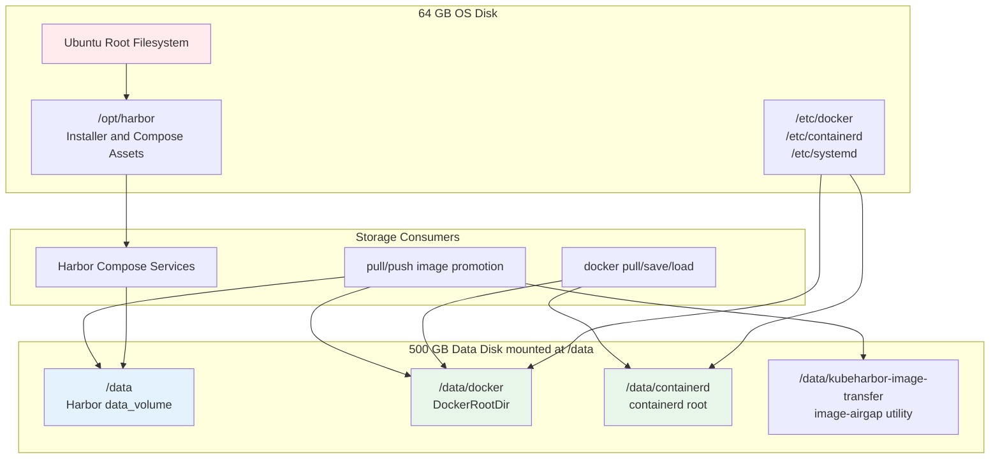

### Disk Safety Controls

The data disk preparation script refuses unsafe formatting when:

- The selected device is not a block device.
- The selected device is not a whole disk.
- The selected device appears to be the OS/root disk.
- Any partition on the selected disk is currently mounted.

That is exactly the kind of blunt guardrail this repo needs. A mistaken `/dev/sda` format in an air-gapped registry install is not a learning moment; it is a rebuild.

---

## Security Architecture

Security in kubeharbor is mostly about controlled artifact intake, TLS trust, secret handling, and minimizing preventable runtime drift.

### Security Control Plane

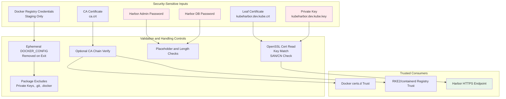

### TLS Trust Model

Harbor presents TLS for `kubeharbor.dev.kube`. Docker clients trust the internal CA through `/etc/docker/certs.d/<registry-host>/ca.crt`. RKE2/containerd clients should use their registry trust configuration instead of Docker's trust path.

The preflight check validates:

- Leaf certificate is readable by OpenSSL.
- Leaf private key is readable and structurally valid.
- Leaf certificate contains the configured Harbor hostname in SAN/CN.
- Leaf certificate and private key match.
- Leaf certificate verifies against the provided CA when a CA file is staged.

### Authentication and Authorization

This document covers the registry platform design, not Harbor user/project governance. The baseline uses the local `admin` credential for post-install validation and bootstrap access. For production-like use, define a project-level access model:

- Separate robot accounts by project or automation domain.
- Avoid sharing the `admin` password with CI/CD jobs.
- Use least-privilege push/pull permissions.
- Disable anonymous access unless there is a deliberate internal distribution use case.
- Rotate robot credentials on a defined cadence or after toolchain compromise.

### Trivy Scanner Posture

Trivy is disabled by default because an air-gapped scanner is only useful when its vulnerability database lifecycle is also managed offline. Enabling a scanner without a DB update/import process creates false confidence. The right sequencing is: registry first, offline DB update process second, scanner enablement third.

---

## Image Promotion Architecture

The image transfer workflow supports the VM clone model and the local-Docker-cache-to-Harbor model.

### Image Transfer Flow

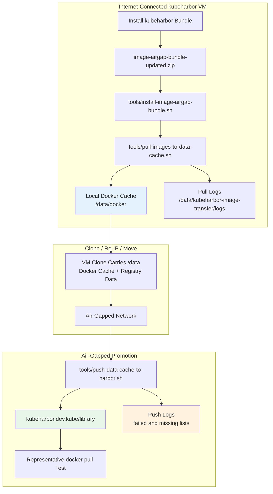

### Push Naming Modes

| Mode | Behavior | Example |
| --- | --- | --- |
| `strip-registry` | Removes the source registry prefix and pushes under the target prefix. | `docker.io/rancher/rancher:v2.14.2` to `kubeharbor.dev.kube/library/rancher/rancher:v2.14.2` |
| `preserve-registry` | Preserves the original registry as part of the destination path. | `docker.io/rancher/rancher:v2.14.2` to `kubeharbor.dev.kube/library/docker.io/rancher/rancher:v2.14.2` |

Defaulting to `strip-registry` keeps internal image paths cleaner. Use `preserve-registry` when collision avoidance matters more than path simplicity.

### Harbor Project Dependency

The push workflow assumes the target Harbor project exists. For the default target `kubeharbor.dev.kube/library`, the `library` project must be present and the authenticated user or robot account must have push rights. Harbor will not create arbitrary projects simply because a Docker push path contains a new namespace.

---

## Operations Architecture

### Day-0 Operations

Day-0 work includes staging artifacts, transferring the bundle, installing Harbor, validating API health, configuring client CA trust, and performing a push/pull smoke test.

### Day-1 Operations

Day-1 work includes:

- Confirming `harbor.service` status.
- Reviewing `docker compose ps` output.
- Validating `/api/v2.0/ping` over HTTPS.
- Confirming the portal image when the DHI override is enabled.
- Logging in as `admin` only for bootstrap or break-glass activities.
- Creating projects and robot accounts for platform workflows.
- Importing CA trust into Docker and RKE2/containerd clients.

### Day-2 Operations

Day-2 work includes:

- Backups of `/data` and Harbor metadata.
- Disk utilization reviews for `/data`, `/data/docker`, registry blobs, and job logs.
- Image retention and garbage collection planning.
- Certificate renewal and client trust update testing.
- Robot credential rotation.
- Offline vulnerability DB lifecycle if Trivy is enabled.
- Periodic representative pull tests from downstream cluster nodes.

### Operational Control Flow

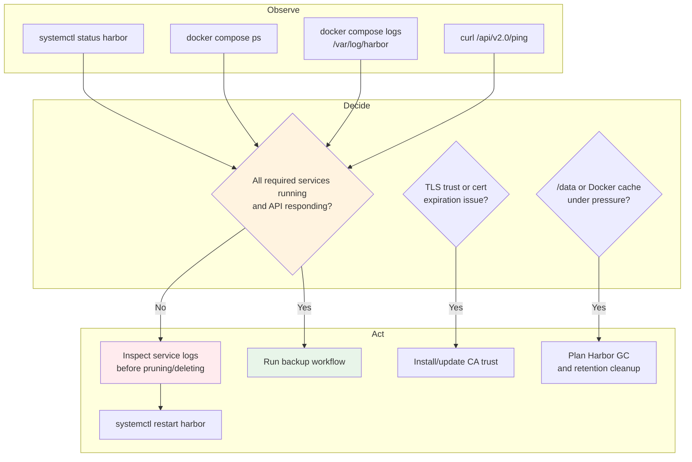

---

## Failure Modes and Recovery

| Failure Mode | Likely Cause | Detection | Recovery |
| --- | --- | --- | --- |
| `/data` not mounted | Disk not formatted, fstab missing/wrong, wrong device path | Preflight fails with mount error | Fix mount, validate with `findmnt /data`, rerun install. |
| OS disk fills during image pull | Docker root still under `/var/lib/docker` | Pull utility blocks or `df -h` shows root pressure | Reconfigure Docker data root under `/data`, restart Docker, repull as needed. |
| Preflight checksum failure | Corrupt/incomplete transfer or stale checksum | `01-preflight.sh` checksum error | Rebuild or retransfer artifact and checksum files. |
| TLS hostname mismatch | Cert SAN/CN does not include `kubeharbor.dev.kube` | OpenSSL check failure | Reissue leaf cert with correct SAN. |
| Docker clients see unknown authority | CA not installed on client | `docker login` or pull x509 error | Install CA under Docker or containerd trust path. |
| Harbor log startup race | Log service not ready before dependent services | Containers restart or logs show connection failures | Use serial startup wrapper; verify `127.0.0.1:1514`. |
| DHI portal fails | Nginx config/runtime mismatch | DHI override script validation or health gate fails | Script restores backups; keep official portal or correct DHI config. |
| Harbor core DB auth failure after rerun | DB password changed while existing DB state remains | Harbor core logs show postgres auth failure | Installer attempts one-time password reconciliation; otherwise restore original DB password or reset DB intentionally. |
| Push fails to target project | Project missing or credentials lack push rights | Push logs contain denied/not found | Create project and grant robot/user push rights. |
| Trivy stale or useless | Offline DB not maintained | Scanner findings absent/stale | Keep Trivy disabled until offline DB lifecycle exists. |

---

## Hardening and Improvement Roadmap

### Immediate Hardening

1. Replace any lab passwords in `config/harbor.env` before promotion.
2. Store Harbor admin and DB passwords outside Git in an approved vault or break-glass escrow.
3. Restrict SSH access to the kubeharbor VM to named administrators.
4. Enforce firewall policy allowing only required inbound management and registry ports.
5. Confirm Docker and RKE2/containerd clients use the correct internal CA trust path.
6. Create Harbor projects and robot accounts per platform domain instead of pushing everything as admin.
7. Schedule backups before large image imports.
8. Document certificate renewal ownership and lead time.

### Near-Term Enhancements

1. Add a scripted Harbor project/bootstrap process for `library`, Rancher, Argo CD, Istio, monitoring, and future platform domains.
2. Add an optional robot account generation workflow that outputs credentials once and stores them securely.
3. Add static validation for `harbor.env` using a schema-style check before sourcing.
4. Add backup restore testing documentation, not just backup creation.
5. Add Harbor garbage collection runbook steps with retention guardrails.
6. Add an optional offline Trivy DB import process before enabling scanner services.
7. Add smoke tests from a representative RKE2 node, not only the Harbor host.
8. Add artifact SBOM or provenance metadata when available from upstream sources.

### Strategic Enhancements

1. Move to a multi-node or replicated Harbor design if uptime requirements exceed lab/internal registry tolerance.
2. Integrate Harbor with enterprise identity rather than relying on local users for steady-state operations.
3. Add immutable tag policies for promoted release images.
4. Add signing/verification policy for critical platform images.
5. Establish a formal image namespace strategy to prevent collisions across upstream registries.
6. Automate registry mirror configuration generation for RKE2/containerd consumers.

---

## Appendices

### Appendix A - Default Deployment Settings

| Setting | Default Intent |
| --- | --- |
| `HARBOR_HOSTNAME` | External registry FQDN, default `kubeharbor.dev.kube`. |
| `HARBOR_VERSION` | Harbor offline installer version, default `v2.15.1`. |
| `HARBOR_CONFIG_VERSION` | Harbor config schema version, default `2.15.1`. |
| `HARBOR_DATA_VOLUME` | Harbor data path, default `/data`. |
| `DOCKER_DATA_ROOT` | Docker runtime storage path, default `/data/docker`. |
| `CONTAINERD_ROOT` | containerd root path, default `/data/containerd`. |
| `IMAGE_TRANSFER_ROOT` | Image transfer utility root, default `/data/kubeharbor-image-transfer`. |
| `INSTALL_DOCKER` | Whether to install Docker from local `.deb` files. |
| `LOAD_EXTRA_IMAGES` | Whether to load saved image archives before Harbor install. |
| `USE_DHI_HARBOR_PORTAL` | Whether to replace only the Harbor portal service image with the DHI image. |
| `INSTALL_TRIVY` | Whether to enable Trivy during Harbor prepare. Keep false unless offline DB lifecycle exists. |

### Appendix B - Primary Operator Commands

```bash
# Build the air-gap artifact package on an Internet-connected Ubuntu staging host.
sudo ./tools/download-airgap-artifacts-on-internet-host.sh

# Install on the air-gapped kubeharbor VM.
sudo ./install.sh

# Check service lifecycle.
sudo systemctl status harbor
sudo systemctl restart harbor

# Inspect Harbor Compose state.
cd /opt/harbor
sudo docker compose ps
sudo docker compose logs --tail=300

# Validate API health.
curl -k https://kubeharbor.dev.kube/api/v2.0/ping

# Install Docker client CA trust.
sudo ./scripts/08-install-client-docker-ca.sh kubeharbor.dev.kube /path/to/ca.crt

# Pull large image list into /data-backed Docker cache.
sudo ./tools/pull-images-to-data-cache.sh

# Push cached images into Harbor.
sudo ./tools/push-data-cache-to-harbor.sh --target kubeharbor.dev.kube/library
```

### Appendix C - Design Decision Log

| Decision | Rationale | Tradeoff |
| --- | --- | --- |
| Use Docker instead of Podman | Aligns with Harbor offline installer and Compose-based runtime. | Docker daemon becomes a platform dependency. |
| Use single-node Harbor | Simpler and appropriate for lab/internal air-gap bootstrap. | No native HA; VM outage impacts all consumers. |
| Keep Docker/containerd data under `/data` | Prevents image workflows from filling the OS disk. | Requires data disk correctness before runtime install. |
| Use serial Harbor startup | Avoids logger readiness races. | Startup is slightly slower but materially more reliable. |
| Keep DHI portal override optional and narrow | Limits blast radius to one Harbor service. | Full stack is not Docker Hardened Image-based. |
| Disable Trivy by default | Avoids stale scanner posture without offline DB lifecycle. | Vulnerability scanning is not available until DB process exists. |
| Generate local checksums | Detects corruption during transfer into the air gap. | Does not replace upstream signature/provenance validation. |

### Appendix D - Non-Goals

- This design does not provide multi-node Harbor high availability.
- This design does not define enterprise identity integration for Harbor.
- This design does not replace a full software supply-chain security platform.
- This design does not make Trivy useful unless offline DB import/update is operationalized.
- This design does not allow direct file-copy ingestion into Harbor registry storage; images must be pushed through the registry API.

### Appendix E - Acceptance Criteria

A kubeharbor deployment is considered ready for internal platform use when:

1. `/data` is mounted and has expected capacity.
2. Docker reports `DockerRootDir` under `/data`.
3. Harbor required services are running in Docker Compose.
4. `https://kubeharbor.dev.kube/api/v2.0/ping` succeeds.
5. Authenticated Harbor API validation succeeds with bootstrap credentials.
6. Docker client CA trust is installed and validated from at least one admin client.
7. RKE2/containerd registry trust is configured and validated from at least one node.
8. A representative image can be pushed to and pulled from the target project.
9. Backup and restore ownership are documented.
10. Robot account/project access is defined for automation consumers.
