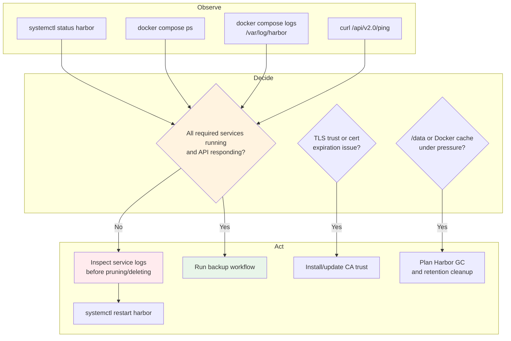

# kubeharbor System Design Document

**Reference Architecture Environment**  
**Version:** 1.2  
**Date:** June 18, 2026

---

## Table of Contents

1. [Executive Summary](#executive-summary)
2. [System Architecture Overview](#system-architecture-overview)
3. [Architecture Principles](#architecture-principles)
4. [Infrastructure Baseline](#infrastructure-baseline)
5. [Repository and Bundle Layout](#repository-and-bundle-layout)
6. [Component Deep Dive](#component-deep-dive)
7. [Deployment Architecture](#deployment-architecture)
8. [Air-Gap Artifact Supply Chain](#air-gap-artifact-supply-chain)
9. [Runtime Architecture](#runtime-architecture)
10. [Storage Architecture](#storage-architecture)
11. [Security Architecture](#security-architecture)
12. [Image Promotion Architecture](#image-promotion-architecture)
13. [Operations Architecture](#operations-architecture)
14. [Failure Modes and Recovery](#failure-modes-and-recovery)
15. [Hardening and Improvement Roadmap](#hardening-and-improvement-roadmap)
16. [Documentation and Diagram Governance](#documentation-and-diagram-governance)
17. [Appendices](#appendices)

---

## Executive Summary

`kubeharbor` is a Docker-based, single-node Harbor deployment bundle for an Ubuntu 24.04 LTS virtual machine operating as an internal container registry for air-gapped Kubernetes and platform engineering workflows. The design goal is straightforward: build a deterministic Harbor host that can be staged on an Internet-connected system, transported into an isolated environment, and used as the upstream registry for RKE2, Rancher, Argo CD, Istio, monitoring, and related platform image promotion.

This is not a high-availability Harbor architecture. That is not a footnote; it is the primary design constraint. The VM is a platform dependency. If it is offline, downstream cluster lifecycle work gets painful quickly. The architecture compensates with predictable installation, explicit artifact validation, `/data`-backed Docker/containerd storage, systemd-managed lifecycle hooks, operational runbooks, and a large-image pull/push workflow designed for air-gapped promotion.

### Key Characteristics

- **Single-node Harbor registry** deployed on Ubuntu 24.04 LTS.
- **Docker Engine and Docker Compose plugin runtime** installed from local `.deb` packages for air-gap compatibility.
- **Harbor v2.15.1 offline installer** staged from an Internet-connected host.
- **TLS-first registry access** using the `kubeharbor.dev.kube` hostname and locally staged certificate material.
- **500 GB `/data` storage model** for Harbor data, Docker image cache, containerd content, and bulk image transfer workflows.
- **Optional Docker Hardened Image portal override** that swaps only the Harbor `portal` service after the official Harbor installer renders Compose assets.
- **Checksum-enforced artifact intake** for Docker packages, Harbor installer, and saved extra image archives.
- **Local Mermaid diagram asset pipeline** that maintains Markdown diagrams, `.mmd` source, SVG exports, PNG exports, and diagram indexes without GitHub Actions.

### Business and Mission Value

The registry is a control point for software supply-chain continuity in disconnected environments. It reduces repeated Internet dependency, establishes a consistent internal image namespace, and gives platform operators a repeatable staging path for large Kubernetes application stacks. In enterprise terms, kubeharbor is an enablement layer: it does not run the mission workload, but the mission workload deployment pipeline depends on it.

---

## System Architecture Overview

The kubeharbor design separates the system into four practical domains:

1. **Internet-connected staging domain** that downloads Docker packages, the Harbor offline installer, and required extra image archives.
2. **Transfer package domain** that bundles verified artifacts into a moveable tarball while excluding secrets and runtime byproducts.
3. **Air-gapped Harbor runtime domain** where Docker, Harbor, certificates, storage, and lifecycle services are installed.
4. **Consumer/client domain** made up of Kubernetes nodes, admin workstations, and image promotion utilities that push to or pull from the registry.

The diagram format intentionally follows the same Mermaid convention used by the `k8s-mystical-mesh-documents` system design document: inline `flowchart TB`, named `cluster_*` subgraphs, HTML line breaks in labels, and explicit `style` declarations for architectural emphasis.

### Architecture Diagram



> Diagram export: [SVG](../diagrams/svg/system-design-document-diagram-12.svg) | [PNG](../diagrams/png/system-design-document-diagram-12.png)

---

## Failure Modes and Recovery

| Failure Mode | Likely Cause | Detection | Recovery |
| --- | --- | --- | --- |
| `/data` not mounted | Disk not formatted, fstab missing/wrong, wrong device path | Preflight fails with mount error | Fix mount, validate with `findmnt /data`, rerun install. |
| OS disk fills during image pull | Docker root still under `/var/lib/docker` | Pull utility blocks or `df -h` shows root pressure | Reconfigure Docker data root under `/data`, restart Docker, repull as needed. |
| Preflight checksum failure | Corrupt/incomplete transfer or stale checksum | `01-preflight.sh` checksum error | Rebuild or retransfer artifact and checksum files. |
| TLS hostname mismatch | Cert SAN/CN does not include `kubeharbor.dev.kube` | OpenSSL check failure | Reissue leaf cert with correct SAN. |
| Docker clients see unknown authority | CA not installed on client | `docker login` or pull x509 error | Install CA under Docker or containerd trust path. |
| Harbor log startup race | Log service not ready before dependent services | Containers restart or logs show connection failures | Use serial startup wrapper and verify `127.0.0.1:1514`. |
| DHI portal fails | Nginx config/runtime mismatch | DHI override validation or health gate fails | Restore backup, keep official portal, or correct DHI config. |
| Harbor core DB auth failure after rerun | DB password changed while existing DB state remains | Harbor core logs show Postgres auth failure | Restore original DB password, reconcile intentionally, or reset DB only when data loss is acceptable. |
| Push fails to target project | Project missing or credentials lack push rights | Push logs contain denied/not found | Create project and grant robot/user push rights. |
| Trivy stale or useless | Offline DB not maintained | Scanner findings absent/stale | Keep Trivy disabled until offline DB lifecycle exists. |

---

## Hardening and Improvement Roadmap

### Immediate Hardening

1. Replace lab passwords in `config/harbor.env` before promotion.
2. Store Harbor admin and DB passwords outside Git in an approved vault or break-glass escrow.
3. Restrict SSH access to the kubeharbor VM to named administrators.
4. Enforce firewall policy allowing only required inbound management and registry ports.
5. Confirm Docker and RKE2/containerd clients use the correct internal CA trust path.
6. Create Harbor projects and robot accounts per platform domain instead of pushing everything as admin.
7. Schedule backups before large image imports.
8. Document certificate renewal ownership and lead time.

### Near-Term Enhancements

1. Add scripted Harbor project/bootstrap for `library`, Rancher, Argo CD, Istio, monitoring, and future domains.
2. Add optional robot account generation that outputs credentials once and stores them securely.
3. Add static validation for `harbor.env` before sourcing.
4. Add restore testing documentation, not just backup creation.
5. Add Harbor garbage collection runbook steps with retention guardrails.
6. Add optional offline Trivy DB import before enabling scanner services.
7. Add smoke tests from a representative RKE2 node.
8. Add artifact SBOM or provenance metadata when available from upstream sources.

### Strategic Enhancements

1. Move to a multi-node or replicated Harbor design if uptime requirements exceed lab/internal registry tolerance.
2. Integrate Harbor with enterprise identity rather than relying on local users for steady-state operations.
3. Add immutable tag policies for promoted release images.
4. Add signing/verification policy for critical platform images.
5. Establish a formal image namespace strategy to prevent collisions across upstream registries.
6. Automate registry mirror configuration generation for RKE2/containerd consumers.

---

## Documentation and Diagram Governance

The authoritative diagram sources live under `diagrams/mermaid-source/*.mmd`. The Markdown blocks in this document are synchronized from those source files, and the export links point to the rendered SVG/PNG assets under `diagrams/svg/` and `diagrams/png/`.

GitHub Actions are not required. Diagram maintenance is local-first:

```bash
./diagrams/apply-diagram-updates.sh . --install-deps --install-browser-deps
./diagrams/apply-diagram-updates.sh .
```

The sync script is intentionally strict. If this document is missing an indexed diagram, if an export line is duplicated, or if a Mermaid block is not immediately followed by the matching export line, the sync fails instead of silently writing bad documentation. This is deliberate. Diagram drift is a documentation supply-chain problem.

Keep these files in the same commit when diagrams change:

- `docs/System-Design-Document.md`
- `diagrams/mermaid-source/*.mmd`
- `diagrams/svg/*.svg`
- `diagrams/png/*.png`
- `diagrams/DIAGRAM-INDEX.md`
- `diagrams/DIAGRAM-INDEX.json`
- `diagrams/DIAGRAM-SYNC-REPORT.md`

---

## Appendices

### Appendix A - Default Deployment Settings

| Setting | Default Intent |
| --- | --- |
| `HARBOR_HOSTNAME` | External registry FQDN, default `kubeharbor.dev.kube`. |
| `HARBOR_VERSION` | Harbor offline installer version, default `v2.15.1`. |
| `HARBOR_CONFIG_VERSION` | Harbor config schema version, default `2.15.1`. |
| `HARBOR_DATA_VOLUME` | Harbor data path, default `/data`. |
| `DOCKER_DATA_ROOT` | Docker runtime storage path, default `/data/docker`. |
| `CONTAINERD_ROOT` | containerd root path, default `/data/containerd`. |
| `IMAGE_TRANSFER_ROOT` | Image transfer utility root, default `/data/kubeharbor-image-transfer`. |
| `INSTALL_DOCKER` | Whether to install Docker from local `.deb` files. |
| `LOAD_EXTRA_IMAGES` | Whether to load saved image archives before Harbor install. |
| `USE_DHI_HARBOR_PORTAL` | Whether to replace only the Harbor portal service image with the DHI image. |
| `INSTALL_TRIVY` | Whether to enable Trivy during Harbor prepare. Keep false unless offline DB lifecycle exists. |

### Appendix B - Primary Operator Commands

```bash
# Build the air-gap artifact package on an Internet-connected Ubuntu staging host.
sudo ./tools/download-airgap-artifacts-on-internet-host.sh

# Install on the air-gapped kubeharbor VM.
sudo ./install.sh

# Check service lifecycle.
sudo systemctl status harbor
sudo systemctl restart harbor

# Inspect Harbor Compose state.
cd /opt/harbor
sudo docker compose ps
sudo docker compose logs --tail=300

# Validate API health.
curl -k https://kubeharbor.dev.kube/api/v2.0/ping

# Install Docker client CA trust.
sudo ./scripts/08-install-client-docker-ca.sh kubeharbor.dev.kube /path/to/ca.crt

# Pull large image list into /data-backed Docker cache.
sudo ./tools/pull-images-to-data-cache.sh

# Push cached images into Harbor.
sudo ./tools/push-data-cache-to-harbor.sh --target kubeharbor.dev.kube/library
```

### Appendix C - Design Decision Log

| Decision | Rationale | Tradeoff |
| --- | --- | --- |
| Use Docker instead of Podman | Aligns with Harbor offline installer and Compose-based runtime. | Docker daemon becomes a platform dependency. |
| Use single-node Harbor | Simpler and appropriate for lab/internal air-gap bootstrap. | No native HA; VM outage impacts all consumers. |
| Keep Docker/containerd data under `/data` | Prevents image workflows from filling the OS disk. | Requires data disk correctness before runtime install. |
| Use serial Harbor startup | Avoids logger readiness races. | Startup is slightly slower but materially more reliable. |
| Keep DHI portal override optional and narrow | Limits blast radius to one Harbor service. | Full stack is not Docker Hardened Image-based. |
| Disable Trivy by default | Avoids stale scanner posture without offline DB lifecycle. | Vulnerability scanning is not available until DB process exists. |
| Generate local checksums | Detects corruption during transfer into the air gap. | Does not replace upstream signature/provenance validation. |
| Render diagrams locally | GitHub Actions are not enabled. | Operators need local Node/Mermaid/Puppeteer dependencies. |

### Appendix D - Non-Goals

- This design does not provide multi-node Harbor high availability.
- This design does not define enterprise identity integration for Harbor.
- This design does not replace a full software supply-chain security platform.
- This design does not make Trivy useful unless offline DB import/update is operationalized.
- This design does not allow direct file-copy ingestion into Harbor registry storage; images must be pushed through the registry API.

### Appendix E - Acceptance Criteria

A kubeharbor deployment is ready for internal platform use when `/data` is mounted, Docker reports `DockerRootDir` under `/data`, Harbor required services are running, `/api/v2.0/ping` succeeds, authenticated API validation succeeds, Docker and RKE2/containerd trust are configured, representative image push/pull succeeds, and backup/restore ownership is documented.
