# kubeharbor System Design Document

**Reference Architecture Environment**  
**Version:** 1.1  
**Date:** June 17, 2026

---

## Table of Contents

1. [Executive Summary](#executive-summary)
2. [System Architecture Overview](#system-architecture-overview)
3. [Architecture Principles](#architecture-principles)
4. [Infrastructure Baseline](#infrastructure-baseline)
5. [Repository and Bundle Layout](#repository-and-bundle-layout)
6. [Component Deep Dive](#component-deep-dive)
7. [Deployment Architecture](#deployment-architecture)
8. [Air-Gap Artifact Supply Chain](#air-gap-artifact-supply-chain)
9. [Runtime Architecture](#runtime-architecture)
10. [Storage Architecture](#storage-architecture)
11. [Security Architecture](#security-architecture)
12. [Image Promotion Architecture](#image-promotion-architecture)
13. [Operations Architecture](#operations-architecture)
14. [Failure Modes and Recovery](#failure-modes-and-recovery)
15. [Hardening and Improvement Roadmap](#hardening-and-improvement-roadmap)
16. [Appendices](#appendices)

---

## Executive Summary

`kubeharbor` is a Docker-based, single-node Harbor deployment bundle for an Ubuntu 24.04 LTS virtual machine operating as an internal container registry for air-gapped Kubernetes and platform engineering workflows. The design goal is to build a deterministic Harbor host that can be staged on an Internet-connected system, transported into an isolated environment, and used as the upstream registry for RKE2, Rancher, Argo CD, Istio, monitoring, and related platform image promotion.

This is not a high-availability Harbor architecture. That is a design constraint, not a detail. The VM is a critical platform dependency, and if it is offline, downstream cluster lifecycle operations will feel it immediately. The architecture compensates with predictable installation, explicit artifact validation, `/data`-backed Docker/containerd storage, systemd-managed lifecycle hooks, clean operational runbooks, and a large-image pull/push workflow designed for air-gapped promotion.

### Key Characteristics

- **Single-node Harbor registry** deployed on Ubuntu 24.04 LTS.
- **Docker Engine and Docker Compose plugin runtime** installed from local `.deb` packages.
- **Harbor v2.15.1 offline installer** staged from an Internet-connected host.
- **TLS-first registry access** using the `kubeharbor.dev.kube` hostname.
- **500 GB `/data` storage model** for Harbor data, Docker image cache, containerd content, and image transfer workflows.
- **Optional Docker Hardened Image portal override** that swaps only the Harbor `portal` service after the official Harbor installer renders Compose assets.
- **Checksum-enforced artifact intake** for Docker packages, Harbor installer, and saved extra image archives.
- **Diagram exports** maintained under `diagrams/mermaid-source`, `diagrams/svg`, and `diagrams/png` so the Markdown and external image assets stay aligned.

---

## System Architecture Overview

The kubeharbor design separates the system into four practical domains:

1. **Internet-connected staging domain** that downloads Docker packages, the Harbor offline installer, and any required extra image archives.
2. **Transfer package domain** that bundles verified artifacts into a moveable tarball while excluding secrets and runtime byproducts.
3. **Air-gapped Harbor runtime domain** where Docker, Harbor, certificates, storage, and lifecycle services are installed.
4. **Consumer/client domain** made up of Kubernetes nodes, admin workstations, and image promotion utilities that push to or pull from the registry.

### Architecture Diagram

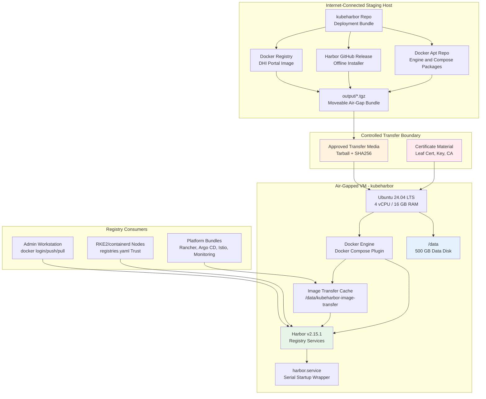

> Diagram export: [SVG](../diagrams/svg/system-design-document-diagram-01.svg) | [PNG](../diagrams/png/system-design-document-diagram-01.png)

---

## Architecture Principles

### Deterministic First, Convenient Second

The bundle prioritizes repeatability over cleverness. Installation order is explicit, version checks are enforced, checksums are validated, and Harbor service startup is serialized to avoid known logger bootstrap races. Air-gapped installers should be boring because failed installs are expensive to unwind when packages and images cannot be fetched on demand.

### Keep Heavy State off the OS Disk

The VM has a 64 GB OS disk and a 500 GB data disk. Docker image pulls, containerd content, Harbor registry blobs, and image transfer logs must live under `/data`. Allowing large image workflows to land under `/var/lib/docker` is a self-inflicted outage.

### Fail Fast Before Mutating the Runtime

Preflight checks block the common deployment killers before the installer gets deep into Harbor state changes: missing settings, weak or placeholder passwords, missing certificates, TLS SAN mismatch, Harbor version mismatch, checksum mismatch, missing data mount, and invalid DHI portal combinations.

### Treat Secrets as Inputs, Not Repo Assets

Production TLS keys, Docker credentials, and registry credentials are intentionally excluded from the package. The repository expects secrets to be injected by the operator at deploy time and managed outside Git.

---

## Infrastructure Baseline

| Layer | Baseline |
| --- | --- |
| VM name | `kubeharbor` |
| FQDN | `kubeharbor.dev.kube` |
| OS | Ubuntu 24.04 LTS amd64 |
| CPU | 4 vCPU minimum target |
| Memory | 16 GB target |
| OS disk | 64 GB |
| Data disk | 500 GB mounted at `/data` |
| Container runtime | Docker Engine + Docker Compose plugin |
| Harbor version | `v2.15.1` |
| Harbor install path | `/opt/harbor` |
| Harbor data path | `/data` |
| Docker data root | `/data/docker` |
| containerd root | `/data/containerd` |
| Image transfer root | `/data/kubeharbor-image-transfer` |
| TLS hostname | `kubeharbor.dev.kube` |
| Lifecycle unit | `harbor.service` |

### Target VM Resource View

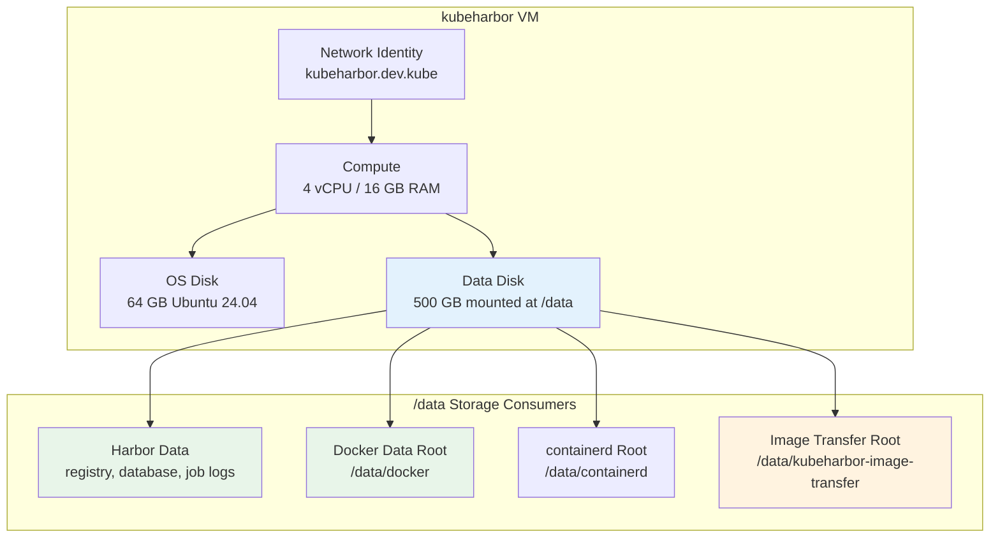

> Diagram export: [SVG](../diagrams/svg/system-design-document-diagram-02.svg) | [PNG](../diagrams/png/system-design-document-diagram-02.png)

---

## Repository and Bundle Layout

| Path | Purpose |
| --- | --- |
| `install.sh` | Top-level orchestrator for the air-gapped install flow. |
| `config/harbor.env` | Operator-editable deployment settings and feature toggles. |
| `config/harbor.yml.template` | Golden Harbor configuration template rendered into `/opt/harbor/harbor.yml`. |
| `certs/` | Local staging location for TLS leaf certificate, key, and CA certificate. |
| `installers/` | Harbor offline installer tarball and checksum file. |
| `packages/docker-debs/` | Offline Docker Engine, CLI, containerd, Buildx, Compose plugin, and dependencies. |
| `images/` | Saved Docker image archives, including the optional DHI Harbor portal image. |
| `scripts/` | Air-gapped install, validation, lifecycle, backup, reset, and client trust scripts. |
| `systemd/harbor.service` | Host lifecycle unit for Harbor Compose stack startup/shutdown. |
| `tools/` | Internet-side artifact downloader, cleanup utility, and large-image transfer wrappers. |
| `diagrams/` | Mermaid source, SVG exports, PNG exports, and diagram indexes. |
| `docs/` | Operator-facing documentation, runbooks, hardening notes, and this design document. |

### Repository Execution Model

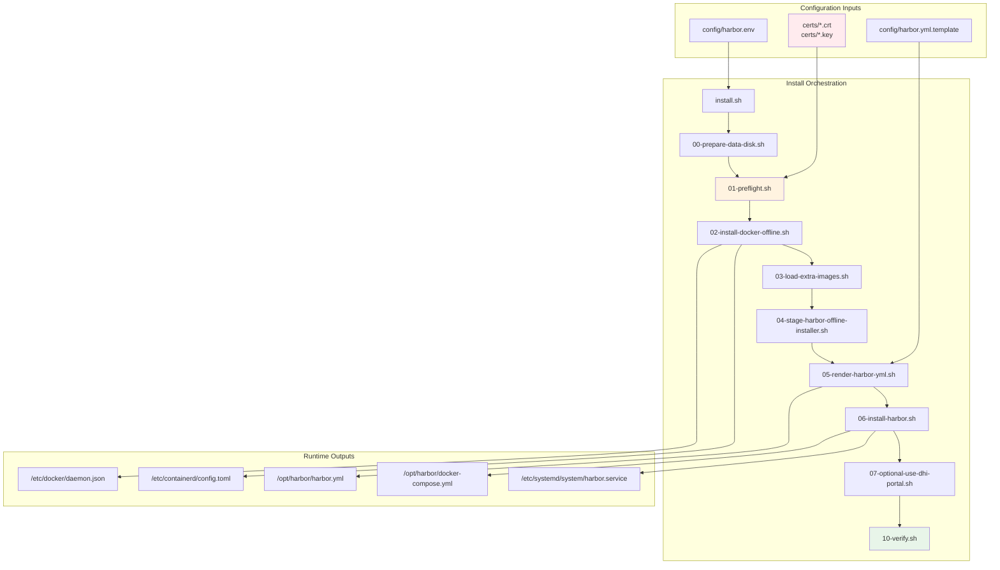

> Diagram export: [SVG](../diagrams/svg/system-design-document-diagram-03.svg) | [PNG](../diagrams/png/system-design-document-diagram-03.png)

---

## Component Deep Dive

### `install.sh` Orchestrator

`install.sh` is the control-plane entry point for the air-gapped VM. It sources `config/harbor.env`, exports settings for child scripts, and runs the install pipeline in a fixed sequence: data disk validation, preflight, Docker install/validation, extra image load, Harbor installer staging, config rendering, Harbor install, optional DHI portal override, and final verification.

### `config/harbor.env`

`config/harbor.env` is the deployment contract. It defines hostname, ports, Harbor version, data paths, TLS source and destination paths, Docker/containerd storage roots, DHI portal settings, firewall behavior, and image transfer root. Any lab passwords in this file must be rotated before production-like use.

### Offline Docker Runtime

The bundle installs Docker Engine and Docker Compose plugin from local `.deb` files. Docker is configured with `data-root` under `/data/docker`, `overlay2`, log rotation, `live-restore`, and a compatibility `docker-compose` wrapper backed by Compose v2.

### Harbor Runtime Components

| Service | Function |
| --- | --- |
| `proxy` | External HTTPS/HTTP entry point for Harbor UI, API, and registry traffic. |
| `core` | Harbor API, authentication integration, metadata, and project logic. |
| `portal` | Web UI static content service. Optionally replaced with DHI portal image. |
| `registry` | OCI/Docker distribution registry backend. |
| `registryctl` | Registry controller sidecar for Harbor registry operations. |
| `jobservice` | Asynchronous jobs for replication, garbage collection, scanning jobs, and task processing. |
| `postgresql` | Harbor metadata database. |
| `redis` | Cache and job coordination backend. |
| `log` | Local syslog/log collector used by the Harbor Compose stack. |
| `trivy` | Optional vulnerability scanner; disabled unless offline DB lifecycle is handled. |

---

## Deployment Architecture

### End-to-End Deployment Flow

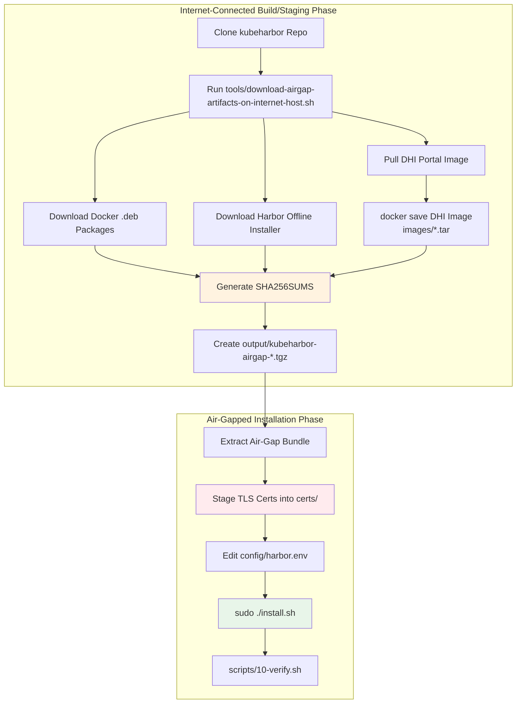

> Diagram export: [SVG](../diagrams/svg/system-design-document-diagram-04.svg) | [PNG](../diagrams/png/system-design-document-diagram-04.png)

### Air-Gapped Install Sequence

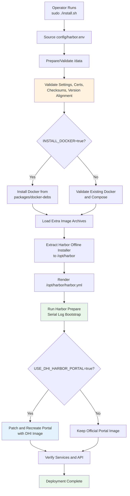

> Diagram export: [SVG](../diagrams/svg/system-design-document-diagram-05.svg) | [PNG](../diagrams/png/system-design-document-diagram-05.png)

---

## Air-Gap Artifact Supply Chain

The artifact supply chain is intentionally split so the Internet-connected system does all external retrieval while the air-gapped VM only performs local validation and install.

| Artifact | Source | Destination | Validation |
| --- | --- | --- | --- |
| Docker `.deb` packages | Docker apt repository and dependencies | `packages/docker-debs/` | Local `SHA256SUMS` file |
| Harbor offline installer | Harbor release asset | `installers/` | Filename/version check and `SHA256SUMS` |
| DHI portal image | Docker registry | `images/*.tar` | `docker save`, inspect JSON, and `SHA256SUMS` |
| TLS cert/key/CA | Operator secure path | `certs/` on target | OpenSSL readability, key match, SAN/CN, optional CA chain |
| Large platform images | Image list bundle workflow | `/data/docker` cache and Harbor registry | Pull/push logs and representative pull tests |

### Artifact Integrity Flow

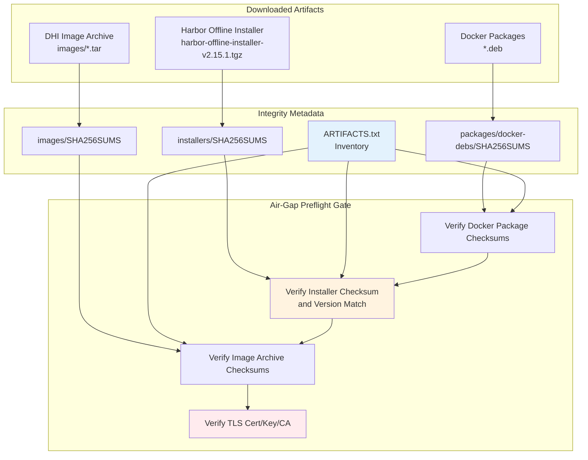

> Diagram export: [SVG](../diagrams/svg/system-design-document-diagram-06.svg) | [PNG](../diagrams/png/system-design-document-diagram-06.png)

---

## Runtime Architecture

Harbor runs as a Docker Compose application under `/opt/harbor`. The systemd unit wraps the startup behavior so operators can use `systemctl start harbor`, while the actual lifecycle remains Compose-based.

### Runtime Component Diagram

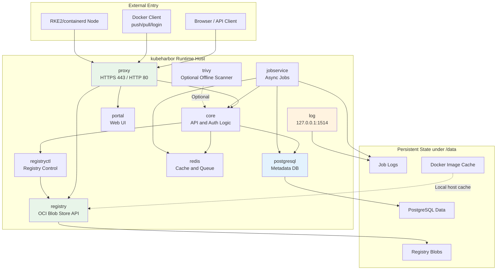

> Diagram export: [SVG](../diagrams/svg/system-design-document-diagram-07.svg) | [PNG](../diagrams/png/system-design-document-diagram-07.png)

### Startup Model

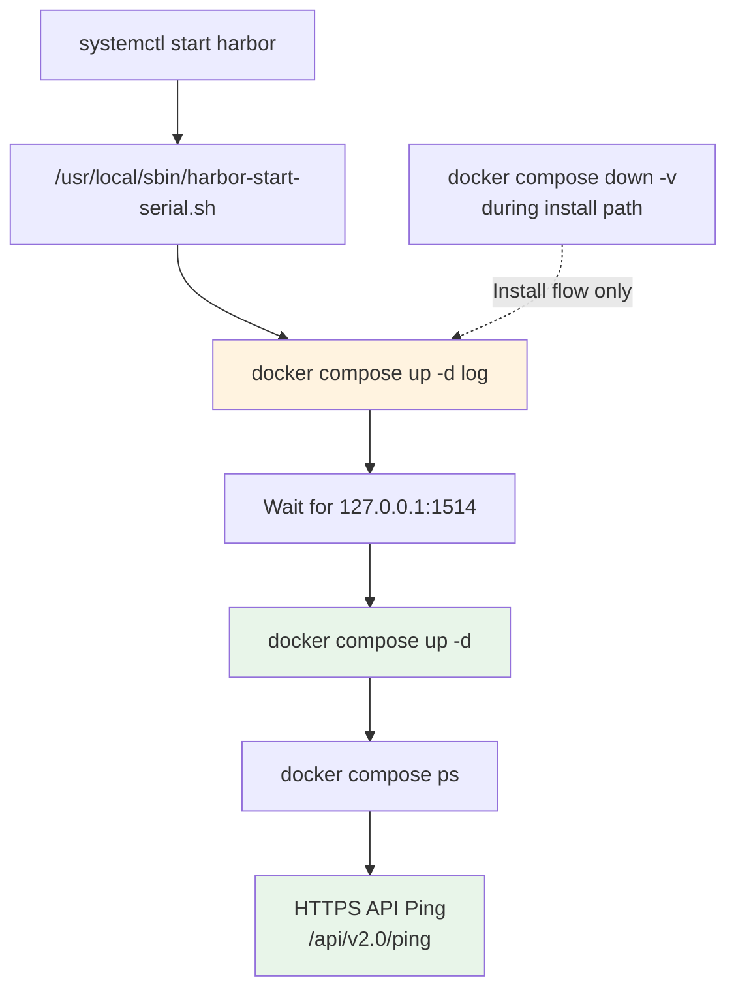

> Diagram export: [SVG](../diagrams/svg/system-design-document-diagram-08.svg) | [PNG](../diagrams/png/system-design-document-diagram-08.png)

---

## Storage Architecture

The storage model is the make-or-break part of this design. Harbor and large image workflows are storage-heavy. The architecture assumes the OS disk is not sized for image acquisition, registry growth, or container runtime content.

| Path | Backing | Owner | Purpose |
| --- | --- | --- | --- |
| `/` | 64 GB OS disk | Ubuntu | Operating system, packages, base configs. |
| `/data` | 500 GB data disk | kubeharbor | Harbor data volume and bulk storage root. |
| `/data/docker` | `/data` | Docker | Docker image cache, layers, container state. |
| `/data/containerd` | `/data` | containerd | containerd content/state for Docker Engine modes that use containerd image store. |
| `/data/kubeharbor-image-transfer` | `/data` | Image transfer utility | Extracted image list bundle, logs, pull/push state. |
| `/opt/harbor` | OS disk plus references to `/data` | Harbor installer | Harbor binaries, scripts, generated Compose files, rendered config. |

### Data Flow Across Storage Paths

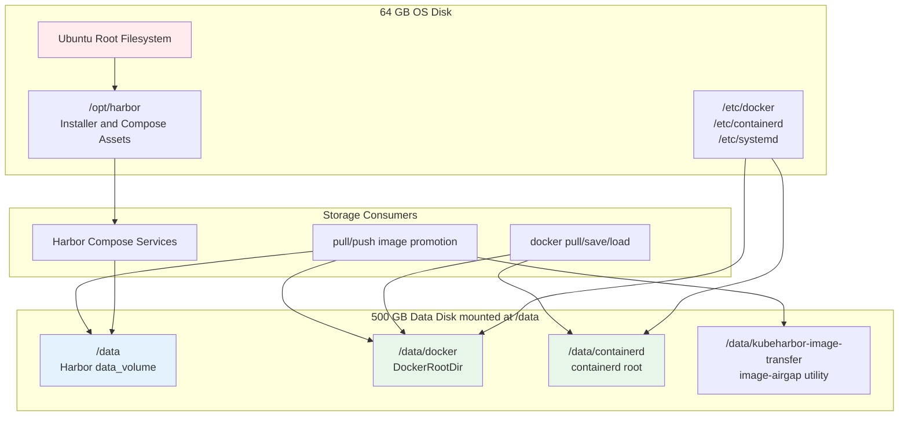

> Diagram export: [SVG](../diagrams/svg/system-design-document-diagram-09.svg) | [PNG](../diagrams/png/system-design-document-diagram-09.png)

---

## Security Architecture

Security in kubeharbor is mostly about controlled artifact intake, TLS trust, secret handling, and minimizing preventable runtime drift.

### Security Control Plane

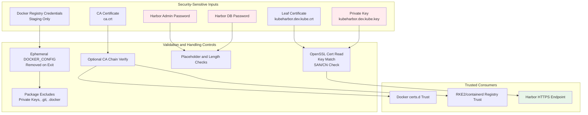

> Diagram export: [SVG](../diagrams/svg/system-design-document-diagram-10.svg) | [PNG](../diagrams/png/system-design-document-diagram-10.png)

### TLS Trust Model

Harbor presents TLS for `kubeharbor.dev.kube`. Docker clients trust the internal CA through `/etc/docker/certs.d/<registry-host>/ca.crt`. RKE2/containerd clients should use their registry trust configuration instead of Docker's trust path.

### Authentication and Authorization

The baseline uses the local `admin` credential for post-install validation and bootstrap access. Production-like use should separate robot accounts by project or automation domain, avoid shared admin credentials in CI/CD jobs, use least-privilege push/pull permissions, and rotate robot credentials on a defined cadence.

### Trivy Scanner Posture

Trivy is disabled by default because an air-gapped scanner is only useful when its vulnerability database lifecycle is also managed offline. Enabling a scanner without a DB update/import process creates false confidence.

---

## Image Promotion Architecture

The image transfer workflow supports the VM clone model and the local-Docker-cache-to-Harbor model.

### Image Transfer Flow

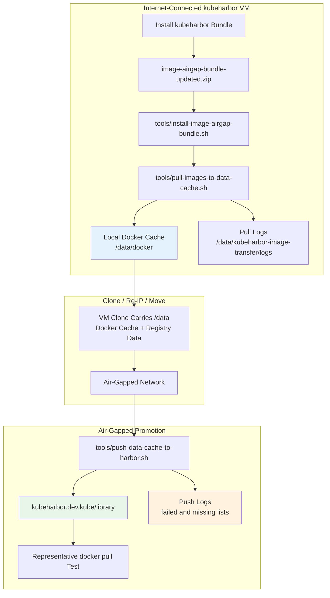

> Diagram export: [SVG](../diagrams/svg/system-design-document-diagram-11.svg) | [PNG](../diagrams/png/system-design-document-diagram-11.png)

### Push Naming Modes

| Mode | Behavior | Example |
| --- | --- | --- |
| `strip-registry` | Removes the source registry prefix and pushes under the target prefix. | `docker.io/rancher/rancher:v2.14.2` to `kubeharbor.dev.kube/library/rancher/rancher:v2.14.2` |
| `preserve-registry` | Preserves the original registry as part of the destination path. | `docker.io/rancher/rancher:v2.14.2` to `kubeharbor.dev.kube/library/docker.io/rancher/rancher:v2.14.2` |

The push workflow assumes the target Harbor project exists. Harbor will not create arbitrary projects simply because a Docker push path contains a new namespace.

---

## Operations Architecture

Day-0 work includes staging artifacts, transferring the bundle, installing Harbor, validating API health, configuring client CA trust, and performing a push/pull smoke test. Day-1 work covers service checks, Compose state, API validation, DHI portal validation, project/robot account bootstrap, and client trust. Day-2 work covers backups, disk reviews, image retention, garbage collection, certificate renewal, robot credential rotation, offline Trivy DB lifecycle, and representative downstream pull tests.

### Operational Control Flow

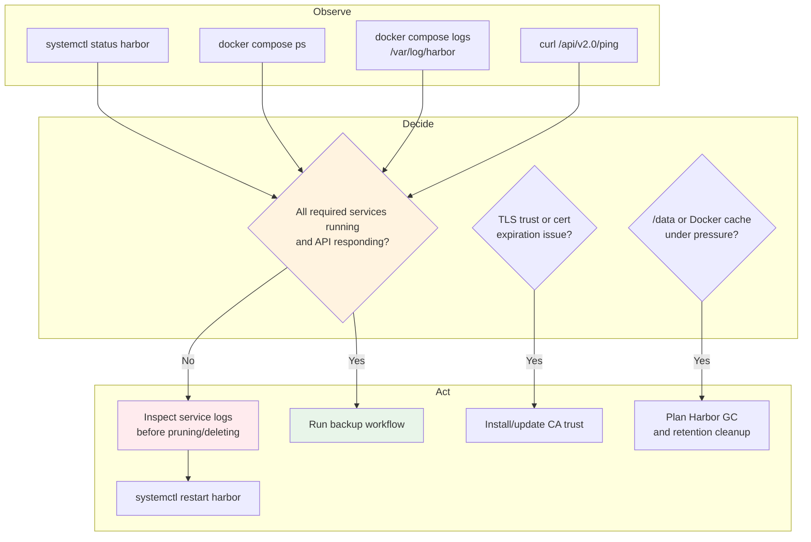

> Diagram export: [SVG](../diagrams/svg/system-design-document-diagram-12.svg) | [PNG](../diagrams/png/system-design-document-diagram-12.png)

---

## Failure Modes and Recovery

| Failure Mode | Likely Cause | Detection | Recovery |
| --- | --- | --- | --- |
| `/data` not mounted | Disk not formatted, fstab missing/wrong, wrong device path | Preflight fails with mount error | Fix mount, validate with `findmnt /data`, rerun install. |
| OS disk fills during image pull | Docker root still under `/var/lib/docker` | Pull utility blocks or `df -h` shows root pressure | Reconfigure Docker data root under `/data`, restart Docker, repull as needed. |
| Preflight checksum failure | Corrupt/incomplete transfer or stale checksum | `01-preflight.sh` checksum error | Rebuild or retransfer artifact and checksum files. |
| TLS hostname mismatch | Cert SAN/CN does not include `kubeharbor.dev.kube` | OpenSSL check failure | Reissue leaf cert with correct SAN. |
| Docker clients see unknown authority | CA not installed on client | `docker login` or pull x509 error | Install CA under Docker or containerd trust path. |
| Harbor log startup race | Log service not ready before dependent services | Containers restart or logs show connection failures | Use serial startup wrapper and verify `127.0.0.1:1514`. |
| DHI portal fails | Nginx config/runtime mismatch | DHI override validation or health gate fails | Restore backup, keep official portal, or correct DHI config. |
| Push fails to target project | Project missing or credentials lack push rights | Push logs contain denied/not found | Create project and grant robot/user push rights. |
| Trivy stale or useless | Offline DB not maintained | Scanner findings absent/stale | Keep Trivy disabled until offline DB lifecycle exists. |

---

## Hardening and Improvement Roadmap

### Immediate Hardening

1. Replace lab passwords in `config/harbor.env` before promotion.
2. Store Harbor admin and DB passwords outside Git in an approved vault or break-glass escrow.
3. Restrict SSH access to the kubeharbor VM to named administrators.
4. Enforce firewall policy allowing only required inbound management and registry ports.
5. Confirm Docker and RKE2/containerd clients use the correct internal CA trust path.
6. Create Harbor projects and robot accounts per platform domain instead of pushing everything as admin.
7. Schedule backups before large image imports.
8. Document certificate renewal ownership and lead time.

### Near-Term Enhancements

1. Add scripted Harbor project/bootstrap for `library`, Rancher, Argo CD, Istio, monitoring, and future domains.
2. Add optional robot account generation that outputs credentials once and stores them securely.
3. Add static validation for `harbor.env` before sourcing.
4. Add restore testing documentation, not just backup creation.
5. Add Harbor garbage collection runbook steps with retention guardrails.
6. Add optional offline Trivy DB import before enabling scanner services.
7. Add smoke tests from a representative RKE2 node.
8. Add artifact SBOM or provenance metadata when available from upstream sources.

### Strategic Enhancements

1. Move to a multi-node or replicated Harbor design if uptime requirements exceed lab/internal registry tolerance.
2. Integrate Harbor with enterprise identity rather than relying on local users for steady-state operations.
3. Add immutable tag policies for promoted release images.
4. Add signing/verification policy for critical platform images.
5. Establish a formal image namespace strategy to prevent collisions across upstream registries.
6. Automate registry mirror configuration generation for RKE2/containerd consumers.

---

## Appendices

### Appendix A - Primary Operator Commands

```bash
sudo ./tools/download-airgap-artifacts-on-internet-host.sh
sudo ./install.sh
sudo systemctl status harbor
sudo systemctl restart harbor
cd /opt/harbor && sudo docker compose ps
curl -k https://kubeharbor.dev.kube/api/v2.0/ping
sudo ./scripts/08-install-client-docker-ca.sh kubeharbor.dev.kube /path/to/ca.crt
sudo ./tools/pull-images-to-data-cache.sh
sudo ./tools/push-data-cache-to-harbor.sh --target kubeharbor.dev.kube/library
```

### Appendix B - Design Decision Log

| Decision | Rationale | Tradeoff |
| --- | --- | --- |
| Use Docker instead of Podman | Aligns with Harbor offline installer and Compose-based runtime. | Docker daemon becomes a platform dependency. |
| Use single-node Harbor | Simpler and appropriate for lab/internal air-gap bootstrap. | No native HA; VM outage impacts all consumers. |
| Keep Docker/containerd data under `/data` | Prevents image workflows from filling the OS disk. | Requires data disk correctness before runtime install. |
| Use serial Harbor startup | Avoids logger readiness races. | Startup is slightly slower but materially more reliable. |
| Keep DHI portal override optional and narrow | Limits blast radius to one Harbor service. | Full stack is not Docker Hardened Image-based. |
| Disable Trivy by default | Avoids stale scanner posture without offline DB lifecycle. | Vulnerability scanning is not available until DB process exists. |
| Generate local checksums | Detects corruption during transfer into the air gap. | Does not replace upstream signature/provenance validation. |

### Appendix C - Non-Goals

- This design does not provide multi-node Harbor high availability.
- This design does not define enterprise identity integration for Harbor.
- This design does not replace a full software supply-chain security platform.
- This design does not make Trivy useful unless offline DB import/update is operationalized.
- This design does not allow direct file-copy ingestion into Harbor registry storage; images must be pushed through the registry API.

### Appendix D - Acceptance Criteria

A kubeharbor deployment is ready for internal platform use when `/data` is mounted, Docker reports `DockerRootDir` under `/data`, Harbor required services are running, `/api/v2.0/ping` succeeds, authenticated API validation succeeds, Docker and RKE2/containerd trust are configured, representative image push/pull succeeds, and backup/restore ownership is documented.
